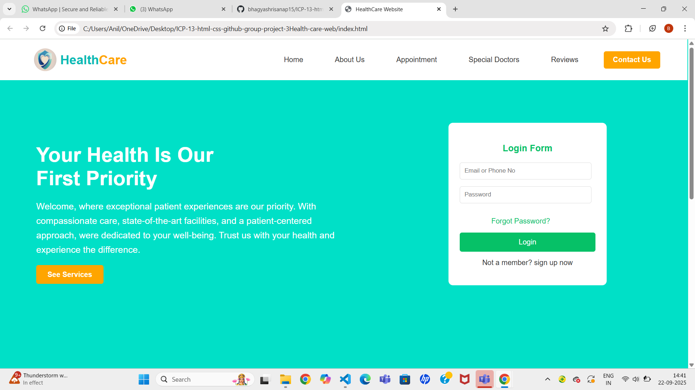
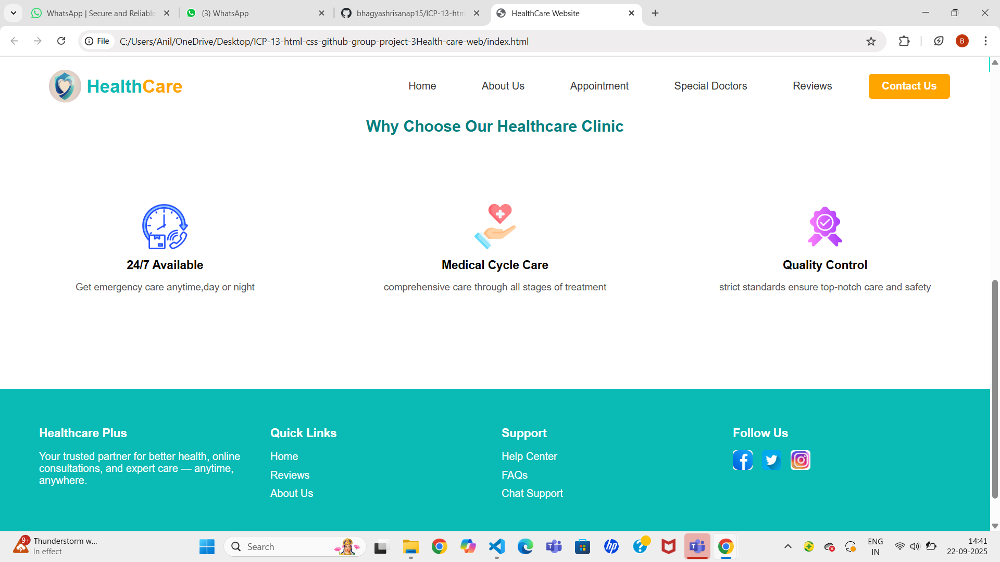

# 🏥 HealthCare Website

Welcome to Healthcare website! 
A responsive healthcare website built using *HTML* and *CSS*.  
It provides essential pages like *Home, About Us, Appointment, Special Doctors, Reviews, and Contact Us* with a modern layout.

---

##  🚀 Features
- *Navigation Bar & Footer* – Easy access across all pages  
- *Home Page* – Overview of healthcare services  
- *Appointment Page* – Book appointments with doctors  
- *Doctors Page* – List of specialist doctors  
- *Reviews Page* – Patient feedback and testimonials  
- *Contact Page* – Address, phone, email, and Google Maps integration  
- *Responsive Design* – Works on desktop, tablet, and mobile  

---
## 🚀 How to Run
1. Download or clone this repository.  
2. Open the index.html file in your browser.  
3. Navigate through the website pages using the navbar.  

---
## 📷 Screenshots

### 🏠 Home Page

---
## 👩‍💻 Author
Developed by *Team Healthcare Project*

Made with [contrib.rocks](https://contrib.rocks).

